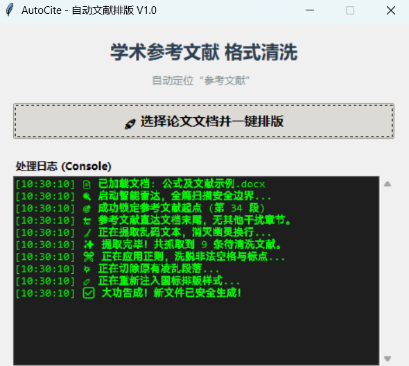
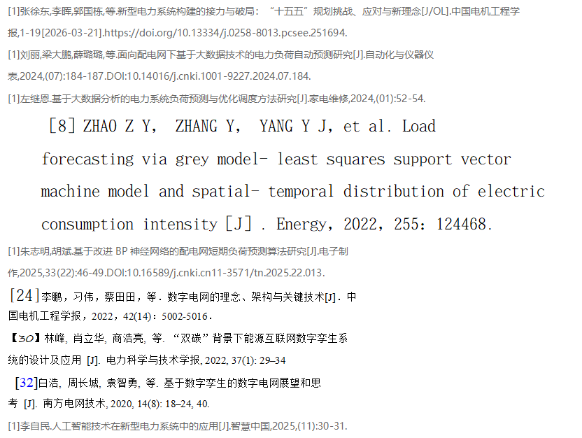
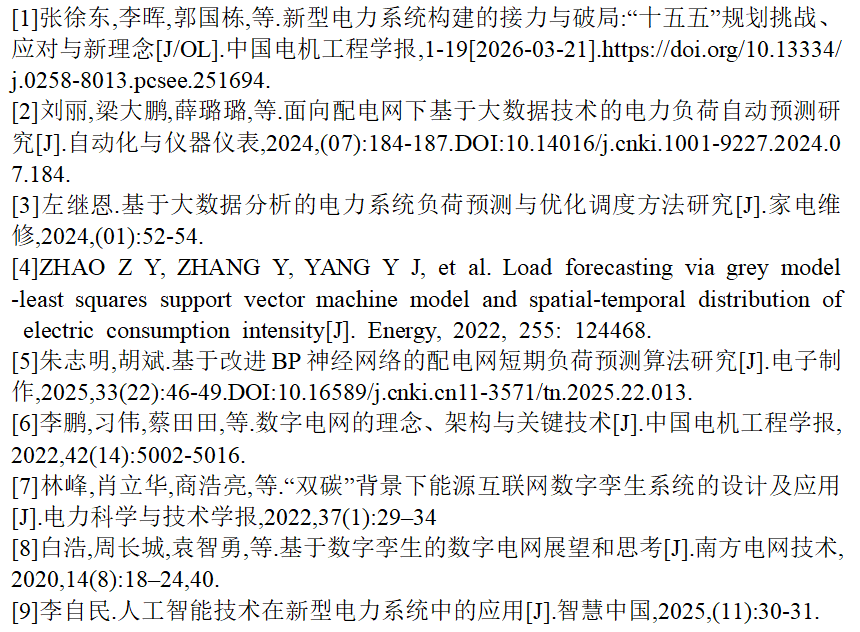

# AutoCite - 智能文献急救箱
AutoCite 是一款专为学术写作开发的参考文献自动化排版工具。它旨在解决从 AI (如 ChatGPT/DeepSeek) 或 PDF 文档中复制参考文献时产生的格式紊乱、幽灵换行及标点不统一等问题。

## 💻 程序界面

## ✨ 核心功能
边界探测：自动识别文档中的“参考文献”章节，在指定区域内进行操作。

断行修复：自动识别并缝合被非正常回车断开的文献条目，恢复引文的完整性。

格式清洗：统一替换全角/半角括号及中括号。自动处理中英文标点后的空格规范，修正中英文字符间的非法空格。强制执行两端对齐、单倍行距及标准学术字体（宋体/Times New Roman）。

自动重排：根据文献出现顺序，自动重新生成 [1], [2] 等标准编号。
## 📊 效果对比
| 排版前 | 排版后 |
| :--- | :--- |
| |  |
## 🚀 使用说明
准备文档：确保您的 Word 文档中包含“参考文献”或“References”的大标题。

运行程序：打开 AutoCite.exe。

选择文件：点击“选择论文文档并一键排版”按钮。

查看结果：程序将自动完成扫描与修复，并在同级目录下生成后缀为“_排版完成”的新文档。

## 🛠️ 技术实现
开发语言：Python 3.12+

核心库：python-docx（负责底层 XML 格式注入与文档处理）

架构：采用多线程异步调度，确保在处理长篇文档时 UI 界面不假死，并实时反馈处理日志。

## 📄 开源协议
本项目采用 MIT License 协议开源。
